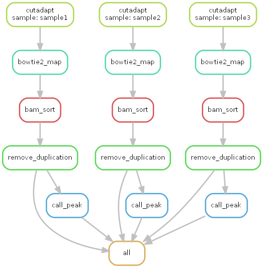

## 1.GenomicsFlowBuilder
`GenomicsFlowBuilder` repository maintain the `flow code` builders, such as `Cromwell (Java)`, `Nextflow (Java)` and `Snakemake (Python)`. The `ATAC_Seq_Flow` folder is a template project organized by  `snakemake` framework.

## 2.Test ATAC_Seq_Flow
### 2.1 Conda environment
```shell
conda create -c bioconda -c conda-forge -n snakemake snakemake
conda activate snakemake
# conda deactivate snakemake
```

### 2.2 Snakemake commands
```shell
# Run Test
snakemake --snakefile atac_seq_flow.py --dryrun

# Run Dag
snakemake --snakefile atac_seq_flow.py --dag

# Run Graph
# mamba install graphviz
snakemake --snakefile atac_seq_flow.py --dag | dot -Tpdf -o graph.pdf
snakemake --snakefile atac_seq_flow.py --dag | dot -Tpng -o graph.png

# Run Jobs
snakemake --snakefile atac_seq_flow.py --printshellcmds --jobs 3 &

# Run Details
snakemake --help
```

### 2.3 Flow graph
